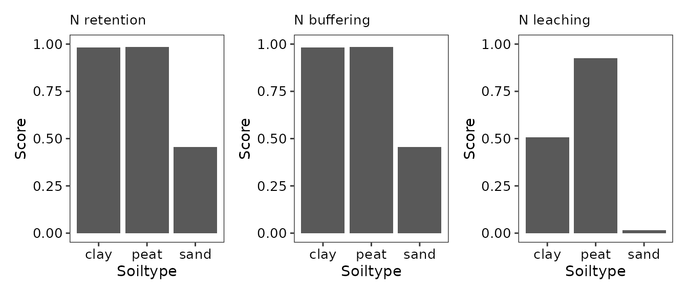
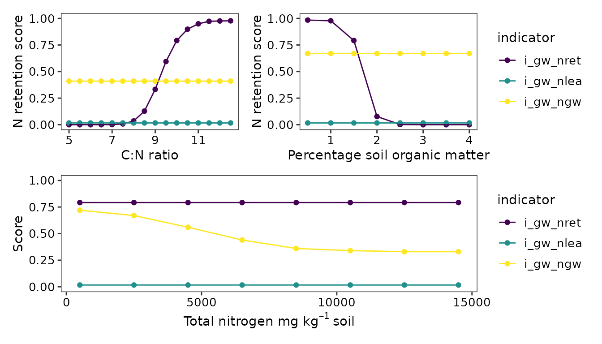
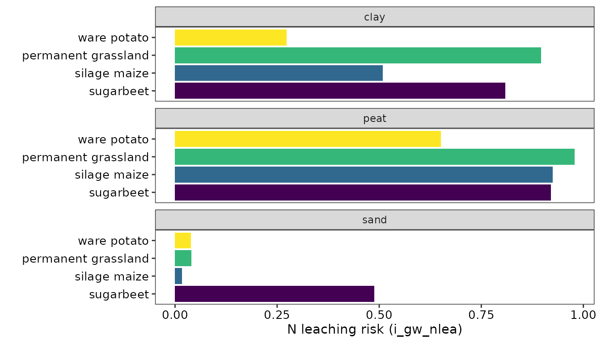

# bln_ess_groundwater

## Introduction

Groundwater is used as source of drinking water, irrigation, and to
supply natural habitats with water. Groundwater must continuously be
recharged by precipitation which infiltrates the soil. Soil plays a
pivotal role in ensuring that there is ample clean groundwater. Soils
may buffer groundwater recharge, filter out nutrients, and breakdown
(organic) contaminants such as pesticides.

It is important to monitor the soil functions that support groundwater
ecosystem services. Because agricultural soils cover large areas, and
may be subject to operations which hinder soil functions in support of
groundwater such as the use of large machines that may compact the soil,
and the use of manure, fertilisers,and pesticides.

The BLN evaluates the following soil functions:

- groundwater recharge
- buffering of nitrogen in soil water
- buffering of pesticides

## Groundwater recharge

Groundwater recharge is evaluated with the
`bln_wat_groundwater_recharge` and `bln_bbwp_bw` functions. These
evaluations are also used separately in the OBIC and BBWP packages
(Verweij et al., 2023; Ros & Verweij, 2023).

The first function, `bln_wat_groundwater_recharge`, evaluates how well
water can infiltrate and seep down to the groundwater. This is affected
by the soil’s cultivation (B_LU_BRP), the risk of soil compaction
(B_SC_WENR), groundwater level (B_GWL_CLASS), presence of drains, soil
texture, and the use of green manure. With these inputs, the function
calculates soil permeability and the risks of sealing and soil
compaction, both of which hamper groundwater recharge.

The second function, `bln_bbwp_bw`, evaluates how well a soil can hold
onto water such that it has sufficient time to infiltrate. This also
depends on the cultivation, groundwater level and soil texture but is
unaffected by soil compaction risk. Instead, this function considers
whether the soil is located in a drought-prone area and the HELP code
corresponding to the fields location (Van Bakel et al., 2005). These
HELP codes relate to the water needs of types of landuse.

See examples of these BLN functions below.

``` r
water_recharge <- bln_wat_groundwater_recharge(
      ID = 15,
      B_LU_BRP = 259,
      B_SC_WENR = 3,
      B_GWL_CLASS = 'VI',
      B_DRAIN = TRUE,
      A_CLAY_MI = 20,
      A_SAND_MI = 65,
      A_SILT_MI = 10,
      A_SOM_LOI = 5,
      M_GREEN = FALSE
      )

water_buffering <- bln_bbwp_bw(
      ID = 15,
      B_LU_BRP = 259,
      B_HELP_WENR = 'Mn25C',
      B_GWL_CLASS = 'VI',
      B_AREA_DROUGHT = TRUE,
      A_CLAY_MI = 20,
      A_SAND_MI = 65,
      A_SILT_MI = 10,
      A_SOM_LOI = 5,
      penalty = TRUE
      )
```

Below we illustrate how these indicators react to changes in soil
texture, groundwater level, and crop type.


## Nutrient buffering

Nutrient buffering is the capacity of the soil to retain nutrients such
that they remain available to plants and avoid leaching to groundwater.
In the BLN, this is evaluated with the functions
`bln_wat_nretention_gw`, `bln_bbwp_ngw`, and `bln_wat_nrisk_gw`. The
first two assess nitrogen retention and the third scores the risk of
nitrogen leaching.These evaluations are also used separately in the OBIC
and BBWP packages (Verweij et al., 2023; Ros & Verweij, 2023).

Retention of nitrogen by the soil is mainly governed by soil type and
soil nutrient contents. Soils more vulnerable to leaching such as sandy
ones, have higher risks and score lower if all else stays the same. See
the differences for sand, peat, and clay when soil organic matter =
1.7%, total nitrogen = 2500 mg N kg⁻¹, and the C:N ratio is 10.



The soil organic matter content, C:N ratio and total soil nitrogen can
also affect the N retention score (i_gw_nret) and risk of N leaching to
groundwater (i_gw_ngw and i_gw_nlea).



The risk of leaching nitrogen to groundwater (i_gw_nlea) is primarily
determined by the soil type (as seen above) and crop (see below). The
function used to calculate this indicator corrects for situations where
supply of P and K and the pH are optimal. In such situations, the risk
of leaching is reduced as crops are likely to take up more nitrogen
under ideal conditions.



## Contaminant buffering

BLN has one function to score the risk of groundwater pollution with
pesticides. This function, `bln_wat_pesticide` estimates the likelihood
that a persistent pesticide penetrates in the soil below 1 metres.
Because this function scores a risk, a poor score does not necessarily
mean that groundwater is or will be contaminated as the function does
not take management or actual precipitation into account. The function
uses
[`BLN::bln_calc_psp`](https://nmi-agro.github.io/BLN/reference/bln_calc_psp.md)
to determine a precipitation surplus, this depends on the cultivated
crop and whether green manure was grown. The other driving variable for
this indicator is soil organic matter content. van den Dool et al.
(2021) describe the function in more detail and describe a demonstration
in practice. They based the development of the function on the formula
described by Tiktak et al. (2006).


## References

**Ros G** & **Verweij S** (2023). *Calculator for BedrijfsBodemWaterPlan
(BBWP)*. <https://github.com/nmi-agro/BedrijfsBodemWaterPlanCalculator>.

**Tiktak A**, **Boesten JJTI**, **Linden AMA van der**, & **Vanclooster
M** (2006). *[Mapping Ground Water Vulnerability to Pesticide Leaching
with a Process-Based Metamodel of
EuroPEARL](https://doi.org/10.2134/JEQ2005.0377)*. Journal of
Environmental Quality 35 (July): 1213–26.

**Van Bakel PJT**, **Huinink J**, **Prak H**, & **Van der Bolt FJE**
(2005). *HELP-2005 Uitbreiding En Actualisering van de HELP-Tabellen Ten
Behoeve van Het Waternood-Instrumentarium*. STOWA Rapportnummer 2005-16,
61.

**van den Dool K**, **Ros GH**, **Geurts JJ**, & **Loon AH van** (2021).
*[Pilot Open Bodemindex: Een Verkenning Naar de Bijdrage van de Bodem
Aan
Grondwaterkwaliteit](https://www.nmi-agro.nl/2022/07/18/pilot-open-bodemindex/)*.
Nutriënten Management Instituut BV.

**Verweij S**, **Ros G**, **Fujita Y**, & **Riechelman B** (2023).
*OBIC: Calculate the Open Bodem Index (OBI) Score*.
<https://github.com/nmi-agro/Open-Bodem-Index-Calculator>.
